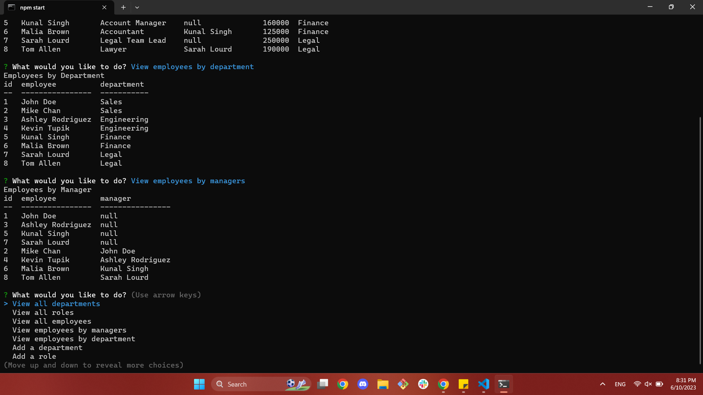

# Employee Tracker []

  ## Description
  The Employee Tracker is a command line-run application that allows a business owner to add departments, roles, and employees, update them, or delete them. This application also allows a user to look at all roles, department, and employees, and its related data. This application should allow a business owner to organize and plan their business.

  After running the program, a user should be faced with a terminal that looks like the screenshot: 
  
  This application uses SQL to fetch data from the database and the following npm packages: [console.table](https://www.npmjs.com/package/console.table), [inquirer](https://www.npmjs.com/package/inquirer/v/8.2.4), and [mysql2](https://www.npmjs.com/package/mysql2). 

  Through development of this application, I have gained more comfort with SQL, specifically with more complicated JOIN statements.  

  ---
  ## Table of Contents 

  - [Installation](#instlalation)
  - [Usage](#usage)
  - [License](#license) 
  - [Contributing](#contributing)
  - [Tests](#tests)
  ---

  ## Installation

  To install this application, a developer must clone this repo, and on the commandline install all dependencies (command: npm i). 

  Before initalization, a user should seed the database through MySQL in the root of the directory. To log in, in the command line, enter mysql -u {user} -p, replacing the user with the proper user, and enter the proper associated password when prompted. Once succesfully in the MySQL command line, source the schema (source db/schema.sql) and then source the seeds (source db/seeds.sql).
  
  To initalize this application, use command npm start or command node index.js. 

  ## Usage 

  To make full use of this application, oe sold be sure to answer all questions prompted by the command line. 

  [This video](https://youtu.be/hWkNjhxzcTw) is a complete walkthrough of how to use this application. 

  ## License

      [License: MIT](https://opensource.org/licenses/MIT)

    Copyright 2023 Anna Langford

    Permission is hereby granted, free of charge, to any person obtaining a copy of this software and associated documentation files (the "Software"), to deal in the Software without restriction, including without limitation the rights to use, copy, modify, merge, publish, distribute, sublicense, and/or sell copies of the Software, and to permit persons to whom the Software is furnished to do so, subject to the following conditions:

    The above copyright notice and this permission notice shall be included in all copies or substantial portions of the Software.

    THE SOFTWARE IS PROVIDED "AS IS", WITHOUT WARRANTY OF ANY KIND, EXPRESS OR IMPLIED, INCLUDING BUT NOT LIMITED TO THE WARRANTIES OF MERCHANTABILITY, FITNESS FOR A PARTICULAR PURPOSE AND NONINFRINGEMENT. IN NO EVENT SHALL THE AUTHORS OR COPYRIGHT HOLDERS BE LIABLE FOR ANY CLAIM, DAMAGES OR OTHER LIABILITY, WHETHER IN AN ACTION OF CONTRACT, TORT OR OTHERWISE, ARISING FROM, OUT OF OR IN CONNECTION WITH THE SOFTWARE OR THE USE OR OTHER DEALINGS IN THE SOFTWARE.

  ## Contributing

  No other developers contributed to this application. 

  ## Tests

  This application was written using Test-Driven Development. To add more applications, please use the TDD paradigm. 

  To run tests, please use command npm test.
